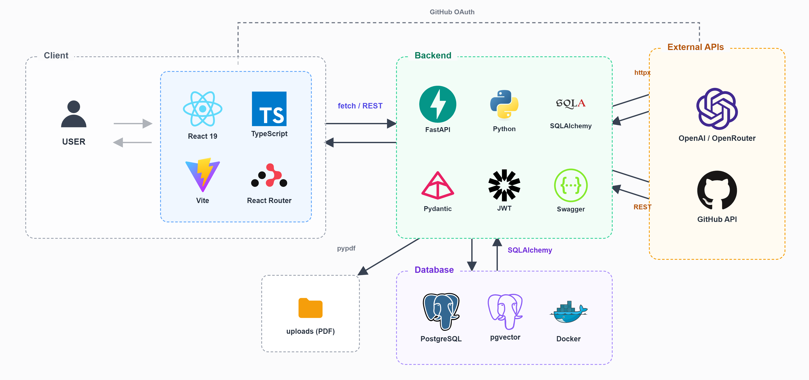

# 26s-w2-c1-01

## 공통과제 II : 협업형 실전 산출물 제작 (2인 1팀)

**목적:** 실시간 인터랙션, LLM Wrapper, Cross-Platform 중 하나의 옵션을 선택해 구현하며, 선택한 기술을 실제로 동작하는 형태의 산출물로 완성한다.

**선택 옵션:**

| 옵션 | 설명 |
|---|---|
| 실시간 인터랙션 | 사용자 간 상태 변화, 실시간 데이터 흐름, 스트리밍 응답 등 실시간성이 드러나는 기능을 구현 |
| LLM Wrapper | LLM API를 활용하여 AI 기능이 포함된 산출물을 구현 |
| Cross-Platform | 하나의 산출물을 여러 실행 환경에서 사용할 수 있도록 구현* |

> *데스크톱 앱 ↔ 모바일 앱; 혹은 다른 폼팩터에서의 앱; 웹만/웹 기반 프레임워크(Electron, Tauri 등) 대신 다른 프레임워크를 시도해보는 것을 적극 권장

**결과물:** 선택한 옵션이 적용된 작동 가능한 산출물, 실행 가능한 코드, 시연 자료 및 관련 문서

---

## 팀원

|  |  |
|---|---|
| **김태현** | **유나연** |
| KAIST | 고려대학교 |
| [terry2549](https://github.com/terry2549) | [yxxnxyxxn](https://github.com/yxxnxyxxn) |
| 벡엔드 | 프론트엔드 |

---

## 선택 옵션

- [ ] 실시간 인터랙션
- [x] LLM Wrapper
- [ ] Cross-Platform

---

## 기획안

- **산출물 주제:** 채용공고 맞춤 이력서 작성 내용 추천 서비스
- **제작 목적:** 사용자가 입력한 채용공고와 개인 포트폴리오 자료를 LLM으로 구조화·비교하여, 지원 직무에 적합한 프로젝트와 경험을 선별하고 근거 기반의 이력서 작성 내용을 추천한다. 적합한 경험이 부족한 경우에는 부족 역량을 보완할 수 있는 실행 가능한 프로젝트도 제안한다.
- **선택 옵션:** LLM Wrapper — 채용공고와 사용자 포트폴리오를 분석·매칭하고, 사실에 근거한 이력서 작성 내용 및 보완 프로젝트를 생성한다.
- **핵심 구현 요소:**
  - 채용공고 URL 또는 이미지에서 담당 업무, 자격 요건, 우대 사항, 요구 역량을 추출하고 공통 스키마로 구조화
  - GitHub, Notion, 블로그, 개인 홈페이지, PDF 이력서 등에서 사용자 경험을 수집하고 프로젝트 단위로 분리·편집
  - 채용공고와 프로젝트를 의미적으로 매칭하여 추천 순위, 강조할 경험, 지원서 문장 초안, 추천 근거를 제공
  - 부족한 역량을 탐지하고 기간·난이도·산출물이 포함된 보완 프로젝트를 추천
- **사용 / 시연 시나리오:** 사용자가 채용공고 URL 또는 이미지를 등록한다. 이후 GitHub URL, 포트폴리오 및 이력서 PDF 등을 등록하면 시스템이 자료를 수집하여 프로젝트 후보를 생성한다. 사용자는 프로젝트 단위로 내용을 확인·수정한 뒤 분석을 실행한다. 서비스는 채용공고 요구 역량, 추천 프로젝트 순위, 이력서에 포함할 핵심 내용과 문장 초안, 각 추천의 출처 근거, 부족 역량 및 보완 프로젝트를 결과 화면에 제공한다.
- **팀원별 역할:** 김태현은 백엔드 API, 데이터베이스, 외부 URL·파일 파싱, LLM 분석 파이프라인, 공고-프로젝트 매칭을 담당한다. 유나연은 입력·업로드 화면, 프로젝트 편집 화면, 분석 진행 상태, 추천 결과 및 근거 시각화 등 프론트엔드를 담당한다. API 명세와 데이터 스키마는 공동으로 정의하고 통합 테스트를 함께 수행한다.


### 개발 일정

| 날짜 | 목표 |
|---|---|
| Day 1 (07/09) | 팀 구성, 기획안 작성, 리포지토리 초기화 및 README 작성 |
| Day 2 (07/10) | 프론트엔드/백엔드 초기 폴더 구조 생성, API 명세 초안 작성, GitHub OAuth 로그인 흐름 및 MSW 기반 목업 API 구축, 대시보드 라우팅 구성 |
| Day 3 (07/11) | DB 스키마 및 인증 설계, 프론트엔드-백엔드 실제 연동, 백엔드 API 플로우 구현 |
| Day 4 (07/12) | 화면 설계 보완 및 상세 기능 정의, 매칭·추천 로직 설계 |
| Day 5 (07/13) | LLM 파이프라인 구현(채용공고 구조화, 텍스트/이미지 입력 지원), 임베딩 기반 하이브리드 추천 스코어링, GitHub 프로젝트 수집 및 편집 화면 구현 |
| Day 6 (07/14) | 이력서 생성 및 추천 결과 화면, 근거 시각화 모달 구현, UI/UX 다듬기 |
| Day 7 (07/15) | 통합 테스트, 버그 수정, 시연 자료 준비 및 최종 발표 |

---

## 구현 명세서

| 구현 요소 | 설명 | 우선순위 |
|---|---|---|
| 채용공고 입력 및 구조화 | URL, 이미지 또는 직접 입력된 채용공고에서 회사명, 직무, 담당 업무, 필수·우대 요건, 역량 키워드를 추출하여 JSON 형태로 저장한다. URL 접근 실패 시 이미지 또는 직접 입력으로 대체할 수 있어야 한다. | 필수 |
| 포트폴리오 수집 및 프로젝트 단위 관리 | GitHub, 공개 Notion, Velog/Tistory, 개인 포트폴리오 URL, PDF 이력서에서 내용을 수집한다. 수집 결과를 프로젝트 단위로 자동 분리하고 사용자가 제목, 역할, 기술, 문제 해결, 성과, 출처를 수정·병합·제외할 수 있게 한다. | 필수 |
| 채용공고-프로젝트 매칭 및 이력서 내용 추천 | 공고 요구 역량과 사용자 프로젝트를 비교하여 적합도 순위를 계산하고, 강조할 경험·기술·문제 해결 과정·성과 및 이력서 문장 초안을 생성한다. 모든 추천에는 원문 출처와 근거를 연결하며 확인되지 않은 수치나 경험은 생성하지 않는다. | 필수 |
| 부족 역량 및 보완 프로젝트 추천 | 공고에서 요구하지만 사용자 자료에서 확인되지 않은 역량을 추출하고, 목표 역량·핵심 기능·예상 기간·산출물이 포함된 보완 프로젝트를 제안한다. | 필수 |
| 결과 내보내기 | 추천 내용을 복사하거나 Markdown/PDF 형식으로 내보내고, 사용자가 수정한 내용을 저장할 수 있도록 한다. | 선택 |
| 사용자 계정 및 분석 기록 | 로그인, 사용자별 포트폴리오와 공고 관리, 이전 분석 비교 기능을 제공한다. 단기 MVP에서는 로컬 세션 또는 테스트 계정으로 대체할 수 있다. | 선택 |

---

## 아키텍처



```
[React SPA (frontend)]
   ├─ GitHub OAuth 로그인 → [FastAPI backend] /auth/github/*
   ├─ 채용공고 URL/이미지 입력 → /job-postings, /job-postings/{id}/analysis-jobs
   ├─ GitHub 저장소 수집 → /github/collection-jobs, /github/repositories
   ├─ 프로젝트 목록/수정 → /projects, /projects/{id}
   ├─ CV(PDF) 업로드/관리 → /cvs, /cvs/upload
   └─ 이력서 생성/결과 조회 → /resumes/resume-jobs, /resumes/resume-results/{id}
                │
                ▼
        [FastAPI backend (backend/app)]
   routers → services (llm_pipeline, embedding_service, recommendation_service, github_client) → models(SQLAlchemy)
                │
        ┌───────┴────────┐
        ▼                ▼
 [PostgreSQL + pgvector]   [LLM API (OpenRouter/OpenAI)]
   (Docker Compose)         임베딩 생성, 채용공고/프로젝트 구조화, 이력서 문장 생성
```

- 프론트엔드는 채용공고·포트폴리오 입력, 진행 상태 폴링, 추천 결과 및 근거 시각화를 담당하는 SPA로 백엔드 REST API를 호출한다.
- 백엔드는 GitHub OAuth 인증, 외부 자료(GitHub/PDF/채용공고) 수집·구조화, LLM 기반 분석 파이프라인, pgvector를 활용한 임베딩 매칭을 담당한다.
- 시간이 걸리는 작업(GitHub 수집, 공고 분석, 이력서 생성)은 `pending → running → completed/failed` 상태를 갖는 비동기 Job으로 처리되며, 프론트엔드는 진행 상태 페이지에서 폴링한다.

---

## 설계 문서

> 프로젝트 성격에 따라 필요한 항목만 작성

### 화면 / 인터페이스 설계

`frontend/src/pages` 기준 화면 구성:

| 화면 | 파일 | 설명 |
|---|---|---|
| 로그인 | `LoginPage` | GitHub OAuth 로그인 |
| 로그인 콜백 | `AuthCallbackPage` | GitHub OAuth 콜백 처리 |
| 메인 / 대시보드 | `MainPage` | 채용공고·프로젝트 현황 진입점 |
| 입력/업로드 | `InputUploadPage` | 채용공고 URL·이미지, GitHub/PDF 등 포트폴리오 입력 |
| 프로젝트 수정 | `ProjectEditPage` | 수집된 프로젝트 단위 편집·병합·제외 |
| 분석 진행 상태 | `AnalysisProgressPage` | 분석 Job 진행 상태 폴링 화면 |
| 추천 결과 | `RecommendationResultPage` | 추천 순위·이력서 문장·근거 시각화 |
| CV 관리 | `CvManagePage` | 업로드한 PDF 이력서 관리 |
| 마이페이지 | `MyPage` | 사용자 정보 및 분석 기록 |

### 데이터 구조

- DB 스키마: [`docs/db_schema_erd.png`](docs/db_schema_erd.png), [`docs/db_schema_erd.md`](docs/db_schema_erd.md)
- 상세 데이터/API 스키마 문서: [`docs/data-schema.md`](docs/data-schema.md), [`docs/api-spec.md`](docs/api-spec.md)
- 주요 테이블(`backend/app/models`): `user`, `job_posting`, `portfolio`, `project`, `evidence`, `cv`, `resume`, `analysis`, `async_job`
- 프로젝트·채용공고는 pgvector 임베딩 컬럼을 가지며, 임베딩 유사도 + 규칙 기반 점수를 혼합한 하이브리드 매칭에 사용된다.

### API / 외부 서비스 연동

| Method / 방식 | Endpoint | 설명 | 비고 |
|---|---|---|---|
| GET | `/auth/github/login`, `/auth/github/callback`, `/auth/me` | GitHub OAuth 로그인 및 사용자 정보 조회 | |
| POST / GET | `/job-postings`, `/job-postings/{id}/analysis-jobs`, `/analysis-jobs/{job_id}` | 채용공고 등록 및 분석 Job 생성/조회 | |
| POST / GET | `/github/collection-jobs`, `/github/collection-jobs/{job_id}`, `/github/repositories`, `/github/repo-access` | GitHub 저장소 수집 Job 생성/조회, 레포 접근 권한 확인 | |
| GET / PATCH | `/projects`, `/projects/{project_id}` | 프로젝트 목록 조회 및 수정 | |
| GET | `/evidences/{evidence_id}` | 추천 근거(출처) 상세 조회 | |
| POST / GET / PATCH / DELETE | `/cvs`, `/cvs/upload`, `/cvs/sections/{section_id}`, `/cvs/{cv_id}` | PDF 이력서 업로드 및 섹션 관리 | |
| POST / GET | `/resumes/resume-jobs`, `/resumes/resume-jobs/{job_id}`, `/resumes/resume-results/{resume_result_id}` | 이력서 생성 Job 및 결과 조회 | |
| 외부 API | LLM API (OpenRouter / OpenAI) | 채용공고·프로젝트 구조화, 임베딩 생성, 이력서 문장 생성 | `backend/app/services/llm_client.py`, `embedding_service.py` |
| 외부 API | GitHub REST API | OAuth 인증 및 저장소 목록/내용 수집 | `backend/app/services/github_client.py` |

---

## 산출물 및 실행 방법

- **산출물 설명:** 채용공고와 GitHub/PDF 포트폴리오를 LLM으로 분석하여, 지원 직무에 맞는 프로젝트를 추천하고 근거 기반 이력서 문장을 생성해주는 웹 서비스
- **실행 환경:** Node.js 20+, Python 3.11+, Docker(PostgreSQL + pgvector)
- **실행 방법:** 아래 [실행 방법](#실행-방법) 참고
- **시연 영상 / 이미지:** (추후 추가 예정)

### 실행 방법

```bash
# 0. 데이터베이스 실행 (PostgreSQL + pgvector)
docker-compose up -d

# 1. 백엔드 환경 설정 및 실행
cd backend
cp .env.example .env   # DATABASE_URL, LLM API 키 등 입력
python -m venv .venv && source .venv/bin/activate
pip install -r requirements.txt
alembic upgrade head
uvicorn app.main:app --reload   # http://localhost:8000

# 2. 프론트엔드 환경 설정 및 실행 (새 터미널)
cd frontend
# .env.local에 백엔드 API Base URL 등 설정 (예: VITE_API_BASE_URL=http://localhost:8000)
npm install
npm run dev   # http://localhost:5173
```

> 백엔드/프론트엔드 각각의 상세 실행법은 [`backend/README.md`](backend/README.md), [`frontend/README.md`](frontend/README.md), [`mock api 백엔드 실행법.md`](mock%20api%20백엔드%20실행법.md) 참고.

### 기술 구성

| 분류 | 사용 기술 |
|---|---|
| 핵심 기술 | React 19 + TypeScript(Vite), FastAPI(Python), LLM 기반 구조화·매칭·문장 생성 파이프라인 |
| 실행 환경 | Node.js / npm(frontend), Python venv(backend), Docker Compose |
| 데이터 저장 | PostgreSQL, pgvector(임베딩 유사도 검색), Alembic 마이그레이션, 로컬 파일 업로드(`backend/uploads`) |
| 외부 API / 서비스 | GitHub OAuth & REST API, LLM API(OpenRouter/OpenAI 호환), PDF 파싱(pypdf) |
| 기타 | React Router, MSW(Mock Service Worker, 프론트엔드 목업), oxlint |

---

## 회고 문서

> [KPT 방법론 참고](https://velog.io/@habwa/%EB%8B%A8%EA%B8%B0-%ED%94%84%EB%A1%9C%EC%A0%9D%ED%8A%B8-%ED%9A%8C%EA%B3%A0-KPT-%EB%B0%A9%EB%B2%95%EB%A1%A0)

### Keep — 잘 된 점, 다음에도 유지할 것

- 백엔드와 프론트엔드 분업과 협업이 잘 됐고, 합치는 과정에서 충돌 없이 진행 됐다.
- API 명세서와 기능 명세서를 확정짓고 확장할 때도 회의를 통해 확장하니 분업이 수월했다. 다음에도 유지하면 좋을 것 같다.

### Problem — 아쉬웠던 점, 개선이 필요한 것

- 현재 개발 직군에서만 쓸 수 있어서 다양한 직군으로 확장이 가능하면 좋을 것 같다.
- 포트폴리오 다양화를 이미지로 구현해서, 노션이나 블로그 URL 을 직접 입력하도록 바꾸면 정확성이 좀 더 올라갈 것 같다.

### Try — 다음번에 시도해볼 것

- 마찬가지로 개발 직군에만 해당되서 다양한 직군으로 확장을 시도할 수 있다. 
- LLM 모델을 외부 API가 아니라 로컬 LLM 을 사용하여 좀 더 우리 서비스에 맞게 학습시켜보면 좋을 것 같다. 

### 팀원별 소감

**김태현:**

> 백엔드 개발을 처음 해봤는데, 정말 많은 걸 배울 수 있는 경험이었다. api 명세서와 기능 명세서 같은 설계도가 분업에 있어서 얼마나 중요한지 깨달을 수 있었다.

**유나연:**

> API 명세서를 보고 받는 데이터를 프론트에 배치하는 경험이 새로웠다. 또한 프롬프트는 영어로 작성하는 것이 훨씬 결과물이 잘 나온다는 것을 알게 되었다.

---

## 참고 자료

### 실시간 인터랙션

**WebSocket**
- https://developer.mozilla.org/en-US/docs/Web/API/WebSockets_API
- https://techblog.woowahan.com/5268/
- https://tech.kakao.com/posts/391
- https://daleseo.com/websocket/
- https://kakaoentertainment-tech.tistory.com/110

**Socket.IO**
- https://socket.io/docs/v4/
- https://inpa.tistory.com/entry/SOCKET-%F0%9F%93%9A-Namespace-Room-%EA%B8%B0%EB%8A%A5
- https://adjh54.tistory.com/549
- https://fred16157.github.io/node.js/nodejs-socketio-communication-room-and-namespace/

**SSE (Server-Sent Events)**
- https://developer.mozilla.org/en-US/docs/Web/API/Server-sent_events
- https://developer.mozilla.org/ko/docs/Web/API/Server-sent_events/Using_server-sent_events
- https://api7.ai/ko/blog/what-is-sse

**TCP / UDP Socket**
- https://docs.python.org/3/library/socket.html
- https://inpa.tistory.com/entry/NW-%F0%9F%8C%90-%EC%95%84%EC%A7%81%EB%8F%84-%EB%AA%A8%ED%98%B8%ED%95%9C-TCP-UDP-%EA%B0%9C%EB%85%90-%E2%9D%93-%EC%89%BD%EA%B2%8C-%EC%9D%B4%ED%95%B4%ED%95%98%EC%9E%90

**gRPC Streaming**
- https://grpc.io/docs/what-is-grpc/core-concepts/
- https://tech.ktcloud.com/entry/gRPC%EC%9D%98-%EB%82%B4%EB%B6%80-%EA%B5%AC%EC%A1%B0-%ED%8C%8C%ED%97%A4%EC%B9%98%EA%B8%B0-HTTP2-Protobuf-%EA%B7%B8%EB%A6%AC%EA%B3%A0-%EC%8A%A4%ED%8A%B8%EB%A6%AC%EB%B0%8D
- https://tech.ktcloud.com/entry/gRPC%EC%9D%98-%EB%82%B4%EB%B6%80-%EA%B5%AC%EC%A1%B0-%ED%8C%8C%ED%97%A4%EC%B9%98%EA%B8%B02-Channel-Stub
- https://inspirit941.tistory.com/371
- https://devocean.sk.com/blog/techBoardDetail.do?ID=167433

**WebRTC**
- https://developer.mozilla.org/en-US/docs/Web/API/WebRTC_API
- https://webrtc.org/getting-started/overview
- https://web.dev/articles/webrtc-basics?hl=ko
- https://devocean.sk.com/blog/techBoardDetail.do?ID=164885
- https://beomkey-nkb.github.io/%EA%B0%9C%EB%85%90%EC%A0%95%EB%A6%AC/webRTC%EC%A0%95%EB%A6%AC/
- https://gh402.tistory.com/45
- https://on.com2us.com/tech/webrtc-coturn-turn-stun-server-setup-guide/

**QUIC / WebTransport**
- https://developer.mozilla.org/en-US/docs/Web/API/WebTransport_API
- https://datatracker.ietf.org/doc/html/rfc9000
- https://news.hada.io/topic?id=13888

#### KCLOUD VM / Cloudflare Tunnel 환경별 주의사항

| 환경 | 사용 가능(권장) 기술 | 포트/조건 | 주의할 기술 |
|---|---|---|---|
| **로컬 / 일반 VM** | HTTP/REST, WebSocket, Socket.IO, SSE, TCP Socket, gRPC Streaming, WebRTC, QUIC/WebTransport 등 대부분 가능 | 직접 포트 개방 가능. 예: 3000, 5000, 8000, 8080, 9000 등. 외부 공개 시 방화벽/보안그룹/공인 IP 설정 필요 | WebRTC는 STUN/TURN 필요 가능. QUIC/WebTransport는 HTTP/3 · UDP 지원 필요 |
| **KCLOUD VM (VPN 내부)** | HTTP/REST, WebSocket, Socket.IO, SSE, WebRTC 시그널링 | 접속 기기 VPN 필요. 기본 허용 포트: **22, 80, 443**. 개발 포트(3000, 8000, 8080 등)는 직접 접근 제한 가능 | TCP Socket은 포트 제한 있음. gRPC는 HTTP/2 설정 필요. WebRTC 미디어·UDP·QUIC/WebTransport 비권장 |
| **KCLOUD VM + Tunnel** | HTTP/REST, WebSocket, Socket.IO, SSE, WebRTC 시그널링 | VM의 `localhost:<port>`를 도메인에 연결. `localPort`는 **1024~65535**. 예: 3000, 8000, 8080 가능 | 순수 TCP Socket, UDP, WebRTC 미디어/DataChannel, QUIC/WebTransport 불가. gRPC 보장 어려움 |
| **외부 서비스 + 우리 도메인** | HTTP/REST, WebSocket, Socket.IO, SSE, WebRTC 시그널링 | Vercel/Netlify/Railway/Render/AWS/GCP 등에 배포 후 CNAME/A 레코드 연결. 보통 외부는 **443** 사용 | WebSocket/gRPC/TCP/UDP는 플랫폼 지원 여부 확인 필요. 서버리스 플랫폼은 장시간 연결 제한 가능 |
| **서버 없이 외부 SaaS 사용** | Supabase Realtime, Firebase, Pusher/Ably, LLM API Streaming | 직접 포트 관리 불필요. 각 서비스 SDK/API 사용 | 커스텀 TCP/UDP 서버 구현 불가. WebRTC는 STUN/TURN 필요할 수 있음 |

### LLM Wrapper

- https://github.com/teddylee777/openai-api-kr
- https://github.com/teddylee777/langchain-kr
- https://devocean.sk.com/blog/techBoardDetail.do?ID=167407
- https://mastra.ai/docs

### Cross-Platform

- https://flutter.dev/
- https://reactnative.dev/
- https://docs.expo.dev/
- https://kotlinlang.org/multiplatform/
