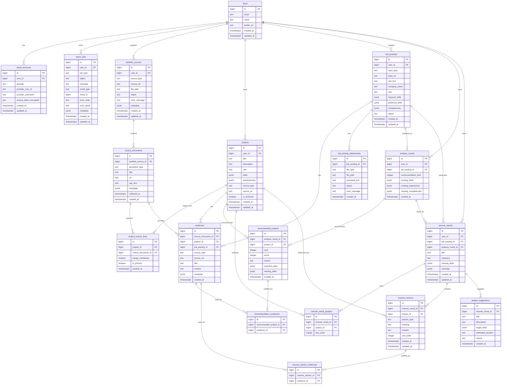

# DB 스키마 및 ERD 초안

> 기준 문서: `docs/functional_spec.md`, `docs/api_spec.md`
>
> 목적: mock API가 아니라 최종 기능 흐름에 필요한 데이터를 기준으로 MVP DB 구조를 먼저 합의하기 위한 초안입니다.

## 설계 방향

- 모든 데이터는 `users`를 기준으로 소유권을 가진다.
- GitHub, Notion, Blog, PDF, LinkedIn 등 포트폴리오 출처는 `portfolio_sources`로 일반화한다.
- 출처에서 추출한 README, Notion page, blog post, PDF text 등 원문 단위는 `source_documents`에 저장한다.
- 프로젝트는 사용자가 최종 편집할 수 있는 정제된 단위이므로 `projects`에 저장한다.
- 하나의 프로젝트가 여러 출처에서 발견될 수 있으므로 `projects`와 `source_documents`는 N:M 관계로 둔다.
- AI가 생성하거나 추천한 모든 결과는 `evidences`를 통해 원문 근거와 연결한다.
- GitHub 수집, 공고 분석, 이력서 생성처럼 시간이 걸리는 작업은 `async_jobs`에서 공통 관리한다.
- 배열이면서 초기 변경 가능성이 큰 값은 PostgreSQL `JSONB`로 저장한다. 예: `skills`, `achievements`, `required_skills`, `warnings`.

## ERD

## 테이블별 역할

| 테이블 | 역할 |
|---|---|
| `users` | 서비스 사용자 기본 정보 |
| `oauth_accounts` | GitHub, Google 등 OAuth 계정 연결 정보 |
| `async_jobs` | GitHub 수집, 공고 분석, 이력서 생성 작업 상태 공통 관리 |
| `portfolio_sources` | GitHub, Notion, Blog, PDF 등 사용자가 등록한 포트폴리오 출처 |
| `source_documents` | 출처에서 추출된 README, 페이지, 글, PDF 텍스트 등 원문 문서 |
| `projects` | AI가 추출하고 사용자가 편집한 최종 프로젝트 단위 |
| `project_source_links` | 하나의 프로젝트가 여러 원문 문서와 연결되는 관계 |
| `evidences` | 추천, 분석, 이력서 문장에 사용되는 원문 근거 |
| `job_postings` | 등록된 채용공고 원문 및 구조화 결과 |
| `job_posting_attachments` | 채용공고 이미지/PDF 첨부와 OCR/추출 결과 |
| `analysis_results` | 채용공고와 프로젝트 비교 분석 결과 |
| `recommended_projects` | 분석 결과에서 추천된 프로젝트와 점수/이유 |
| `recommendation_evidences` | 추천 프로젝트와 근거의 N:M 연결 |
| `resume_results` | 생성된 이력서 초안 전체 결과 |
| `resume_result_projects` | 이력서 생성에 사용자가 선택한 프로젝트 목록 |
| `resume_sections` | 이력서 섹션별 생성 문장 |
| `resume_section_evidences` | 이력서 문장과 근거의 N:M 연결 |
| `project_suggestions` | 부족 역량을 보완하기 위한 신규 프로젝트 제안 |

## MVP에서 우선 구현할 테이블

1. `users`
2. `oauth_accounts`
3. `async_jobs`
4. `portfolio_sources`
5. `source_documents`
6. `projects`
7. `project_source_links`
8. `evidences`
9. `job_postings`
10. `analysis_results`
11. `recommended_projects`
12. `recommendation_evidences`
13. `resume_results`
14. `resume_result_projects`
15. `resume_sections`
16. `resume_section_evidences`
17. `project_suggestions`

`job_posting_attachments`는 이미지/PDF 입력을 바로 구현할 경우 MVP에 포함하고, URL/텍스트 입력만 먼저 구현한다면 2차로 미뤄도 됩니다.

## 주요 상태값

| 대상 | 값 |
|---|---|
| `async_jobs.status` | `pending`, `running`, `completed`, `failed` |
| `async_jobs.job_type` | `github_collection`, `job_posting_analysis`, `resume_generation` |
| `portfolio_sources.source_type` | `github`, `notion`, `velog`, `tistory`, `website`, `pdf`, `linkedin`, `google_drive` |
| `portfolio_sources.status` | `pending`, `collecting`, `completed`, `failed` |
| `job_postings.input_type` | `url`, `text`, `image`, `pdf` |
| `job_postings.status` | `pending`, `extracting`, `completed`, `failed` |

## JSONB로 둘 필드

| 필드 | 이유 |
|---|---|
| `projects.skills` | 초기에는 배열 저장이 충분하고, 검색 요구가 커지면 `project_skills`로 분리 가능 |
| `projects.achievements` | 성과 문장이 자유 형식 배열 |
| `job_postings.required_skills` | LLM 구조화 결과이며 공고마다 형태가 유동적 |
| `job_postings.preferred_skills` | LLM 구조화 결과이며 공고마다 형태가 유동적 |
| `job_postings.competencies` | 역량 표현이 자유 형식 배열 |
| `analysis_results.missing_*` | 분석 결과 구조가 기능 확장에 따라 바뀔 수 있음 |
| `recommended_projects.matched_skills` | 추천 결과의 부가 정보 |
| `recommended_projects.missing_skills` | 추천 결과의 부가 정보 |
| `resume_results.missing_skills` | 최종 이력서 결과의 부가 정보 |
| `resume_results.warnings` | 안전 규칙 위반 방지를 위한 경고 목록 |
| `project_suggestions.target_skills` | 추천 프로젝트의 목표 기술 목록 |
| `*.metadata` | 외부 API 응답, OCR 정보, LLM 추론 메타데이터 등 확장 필드 |

## API 응답과 테이블 매핑

| API | 주 테이블 |
|---|---|
| `GET /auth/github/callback` | `users`, `oauth_accounts` |
| `GET /me` | `users` |
| `POST /github/collection-jobs` | `async_jobs`, `portfolio_sources` |
| `GET /github/collection-jobs/{jobId}` | `async_jobs`, `projects`, `source_documents`, `evidences` |
| `GET /projects` | `projects`, `evidences` |
| `PATCH /projects/{projectId}` | `projects` |
| `POST /job-postings` | `job_postings`, `job_posting_attachments` |
| `POST /job-postings/{jobPostingId}/analysis-jobs` | `async_jobs` |
| `GET /analysis-jobs/{jobId}` | `async_jobs`, `analysis_results`, `recommended_projects`, `recommendation_evidences`, `evidences` |
| `POST /resume-jobs` | `async_jobs`, `resume_result_projects` |
| `GET /resume-jobs/{jobId}` | `async_jobs`, `resume_results` |
| `GET /resume-results/{resumeResultId}` | `resume_results`, `resume_sections`, `resume_section_evidences`, `project_suggestions` |
| `GET /evidences/{evidenceId}` | `evidences` |

## 추후 분리 후보

아래 테이블은 MVP에서는 JSONB로 시작해도 되지만, 검색/통계/필터링이 중요해지면 별도 테이블로 분리하는 것이 좋습니다.

- `skills`
- `project_skills`
- `job_posting_required_skills`
- `job_posting_preferred_skills`
- `competencies`
- `project_achievements`
