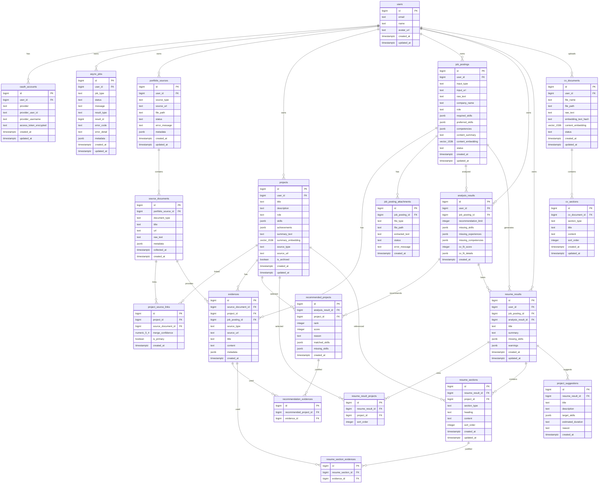

# DB Schema and ERD

> 기준 코드: `backend/app/models/*.py`, `backend/alembic/versions/*.py`  
> 갱신일: 2026-07-15

이 문서는 현재 백엔드가 실제로 사용하는 PostgreSQL 스키마를 기준으로 정리한다. 초기 설계안이 아니라 SQLAlchemy 모델과 Alembic 마이그레이션에 반영된 최신 구조가 기준이다.

## 설계 요약

- 모든 사용자 소유 데이터는 `users.id`를 기준으로 묶인다.
- GitHub OAuth 계정은 `oauth_accounts`에 저장하며, GitHub access token은 암호화된 문자열로 보관한다.
- GitHub 저장소 수집 결과는 `portfolio_sources`, `source_documents`, `projects`, `project_source_links`, `evidences`에 나뉘어 저장된다.
- 사용자가 업로드한 CV PDF는 `cv_documents`, `cv_sections`에 저장된다. CV의 프로젝트성 섹션은 `projects.source_type = 'cv'` 프로젝트와 `evidences.source_type = 'cv'` 근거로 동기화된다.
- 채용공고는 `job_postings`에 저장되고, 공고 요약/프로젝트 요약/CV 본문에는 pgvector `vector(1536)` 임베딩 캐시를 둘 수 있다.
- 분석, 추천, 이력서 초안 생성처럼 시간이 걸리는 작업은 `async_jobs`에서 상태를 관리한다.
- 추천 근거와 이력서 섹션 근거는 각각 `recommendation_evidences`, `resume_section_evidences` 조인 테이블로 연결한다.

## ERD

## 테이블 역할

| 테이블 | 역할 |
|---|---|
| `users` | 서비스 사용자 기본 정보 |
| `oauth_accounts` | GitHub OAuth 연결 정보와 암호화된 access token |
| `async_jobs` | GitHub 수집, 공고 분석, 이력서 생성 작업 상태 |
| `portfolio_sources` | GitHub 전체 수집 또는 수동 저장소 추가 같은 포트폴리오 원천 |
| `source_documents` | README 등 원천 문서 본문 |
| `projects` | 추천과 이력서 생성에 사용하는 프로젝트 단위. GitHub와 CV 기반 프로젝트를 모두 포함 |
| `project_source_links` | 프로젝트와 원천 문서의 N:M 연결 |
| `evidences` | 추천/이력서 문장을 뒷받침하는 원문 근거 |
| `cv_documents` | 업로드된 CV PDF 메타데이터, 원문, 임베딩 캐시 |
| `cv_sections` | CV를 기본정보/학력/경험/프로젝트/기술 등 섹션으로 나눈 결과 |
| `job_postings` | 채용공고 원문, 구조화된 요구사항, 요약/임베딩 |
| `job_posting_attachments` | 공고 첨부 파일 추출 결과. 현재 라우터에서는 직접 사용하지 않음 |
| `analysis_results` | 공고와 프로젝트/CV의 적합도 분석 결과 |
| `recommended_projects` | 분석 결과별 추천 프로젝트와 점수/사유 |
| `recommendation_evidences` | 추천 프로젝트와 근거의 N:M 연결 |
| `resume_results` | 생성된 이력서 초안 결과 |
| `resume_result_projects` | 이력서 생성에 선택된 프로젝트 목록과 순서 |
| `resume_sections` | 이력서 섹션별 생성 문장 |
| `resume_section_evidences` | 이력서 섹션과 근거의 N:M 연결 |
| `project_suggestions` | 부족 역량 보완용 추천 프로젝트 |

## 주요 제약과 인덱스

| 대상 | 내용 |
|---|---|
| `oauth_accounts` | `(provider, provider_user_id)` unique |
| `recommended_projects` | `(analysis_result_id, project_id)` unique |
| `recommendation_evidences` | `(recommended_project_id, evidence_id)` unique |
| `resume_result_projects` | `(resume_result_id, project_id)` unique |
| `resume_section_evidences` | `(resume_section_id, evidence_id)` unique |
| FK 소유 컬럼 | `user_id`, `project_id`, `job_posting_id`, `analysis_result_id`, `resume_result_id`, `cv_document_id` 등 주요 FK에 index |
| 상태/분류 컬럼 | `async_jobs.job_type/status`, `portfolio_sources.source_type/status`, `job_postings.status`, `evidences.source_type`, `cv_sections.section_type` 등에 index |

## 주요 상태값

| 컬럼 | 현재 코드에서 쓰는 값 |
|---|---|
| `async_jobs.status` | `running`, `completed`, `failed` |
| `async_jobs.job_type` | `github_collection`, `job_posting_analysis`, `resume_generation` |
| `portfolio_sources.source_type` | `github`, `github_manual` |
| `portfolio_sources.status` | `collecting`, `completed` |
| `projects.source_type` | `github`, `github_manual`, `cv` |
| `evidences.source_type` | `github`, `cv`, `recommendation_match` |
| `job_postings.input_type` | `url`, `text`, `image` |
| `job_postings.status` | `completed` |
| `cv_documents.status` | `ready`, `empty` |

## JSONB/Vector 컬럼

| 컬럼 | 용도 |
|---|---|
| `projects.skills`, `projects.achievements` | 프로젝트 기술/성과 목록 |
| `projects.summary_text`, `projects.summary_embedding` | 프로젝트 검색/추천용 요약과 1536차원 임베딩 |
| `job_postings.required_skills`, `preferred_skills`, `competencies` | LLM이 구조화한 공고 요구사항 |
| `job_postings.content_summary`, `content_embedding` | 공고 분석용 요약과 1536차원 임베딩 |
| `analysis_results.cv_fit_details` | CV 적합도 설명, 매칭/부족 스킬, 섹션 근거, rule/vector 점수 |
| `recommended_projects.matched_skills`, `missing_skills` | 추천 프로젝트별 매칭/부족 스킬 |
| `evidences.metadata` | GitHub repo id, CV 문서/섹션 id, 추천 매칭 설명 등 확장 메타데이터 |
| `cv_documents.embedding_text_hash`, `content_embedding` | CV 섹션 본문의 임베딩 캐시 무효화/재사용 |

## API와 테이블 매핑

| API | 주요 테이블 |
|---|---|
| `GET /auth/github/callback` | `users`, `oauth_accounts` |
| `GET /me` | `users`, `oauth_accounts` |
| `POST /github/collection-jobs` | `async_jobs`, `portfolio_sources`, `source_documents`, `projects`, `project_source_links`, `evidences` |
| `GET /github/collection-jobs/{jobId}` | `async_jobs`, `projects` |
| `POST /github/repositories` | `portfolio_sources`, `source_documents`, `projects`, `project_source_links`, `evidences` |
| `GET /projects` | `projects`, `evidences` |
| `PATCH /projects/{projectId}` | `projects` |
| `POST /job-postings` | `job_postings` |
| `POST /job-postings/{jobPostingId}/analysis-jobs` | `async_jobs` |
| `GET /analysis-jobs/{jobId}` | `async_jobs`, `analysis_results`, `recommended_projects`, `recommendation_evidences`, `evidences`, `job_postings`, `projects` |
| `GET /cvs` | `cv_documents`, `cv_sections` |
| `POST /cvs/upload` | `cv_documents`, `cv_sections`, `projects`, `evidences` |
| `PATCH /cvs/sections/{sectionId}` | `cv_sections`, `cv_documents`, `projects`, `evidences` |
| `DELETE /cvs/{cvId}` | `cv_documents`, `cv_sections`, `projects`, `evidences` |
| `POST /resume-jobs` | `async_jobs`, `resume_results`, `resume_result_projects`, `resume_sections`, `resume_section_evidences`, `project_suggestions` |
| `GET /resume-jobs/{jobId}` | `async_jobs` |
| `GET /resume-results/{resumeResultId}` | `resume_results`, `resume_sections`, `resume_section_evidences`, `project_suggestions` |
| `GET /evidences/{evidenceId}` | `evidences`, `projects`, `job_postings` |
